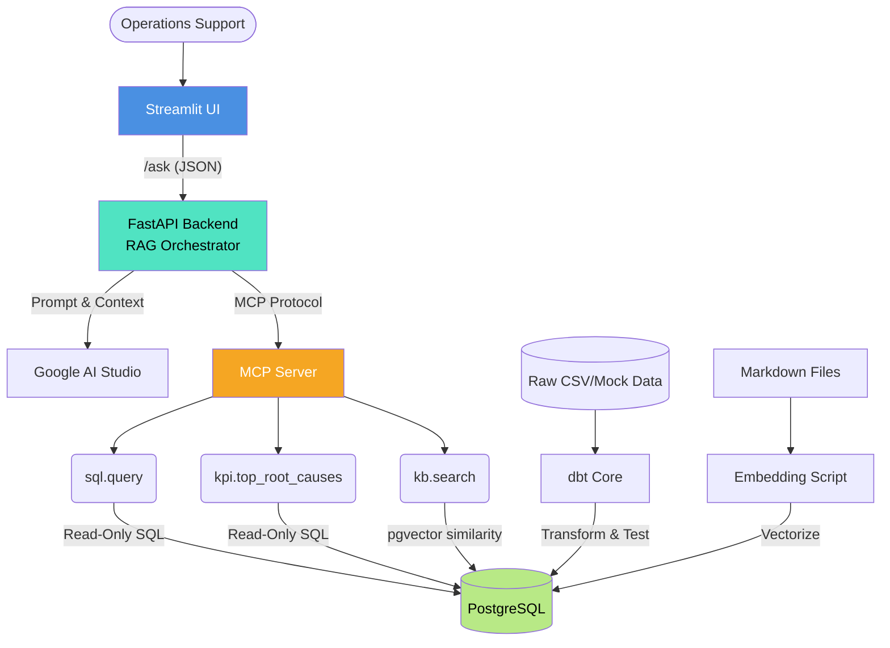
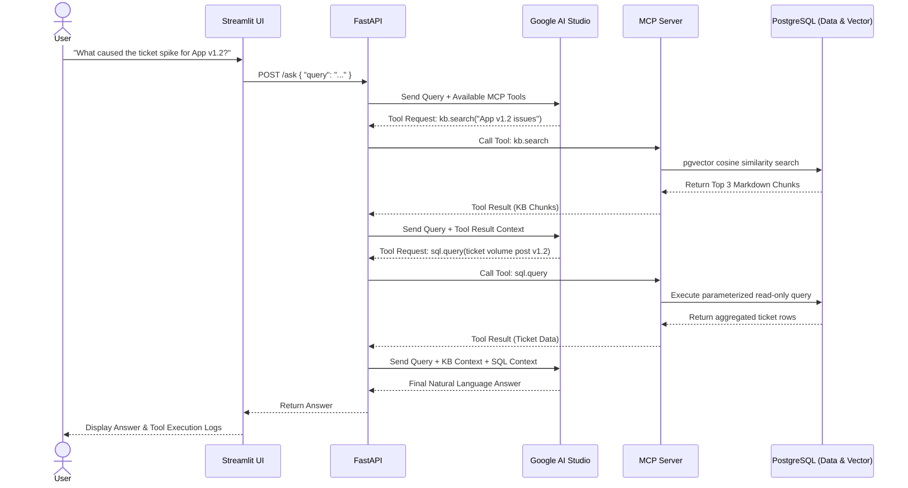

# Architecture Design: Deep Insights Copilot

## 1. System Overview

The Deep Insights Copilot is designed to be a robust, deployment-grade RAG (Retrieval-Augmented Generation) application. It bridges internal structured operational data and unstructured knowledge base documents, using Google AI Studio as the intelligence engine.

The architecture strictly adheres to the **Model Context Protocol (MCP)** to ensure AI tool-calling is standardized, logged, and isolated from core business logic.

---

## 2. High-Level Architecture Diagram

---

## 3. Component Details

### 3.1 Data Pipeline (dbt + PostgreSQL)
- **Database:** PostgreSQL 15+ with the `pgvector` extension installed.
- **Data Loading:** Synthetic data generation scripts (Python/Faker) will generate raw data into schema `raw`.
- **dbt Transformations:** dbt will transform `raw` data into a dimensional **Star Schema** in the `analytics` schema to optimize for analytical queries by the AI.
  - **Fact Table:** `fact_tickets`
  - **Dimension Tables:** `dim_customers`, `dim_products`, `dim_login_access`
- **Data Tests:** dbt will run standard assertions (not null, unique, referential integrity).

### 3.2 Vector Store (pgvector)
- **Table Structure:** A table `kb_embeddings` storing `id`, `metadata` (filename, title), `content` (text chunk), and `embedding` (vector).
- **Ingestion:** A Python script utilizing SentenceTransformers (or Google Embeddings API) to chunk markdown files and insert vectors.

### 3.3 Core Backend (FastAPI)
- Acts as the orchestrator.
- Manages the conversation history.
- Communicates with Google AI Studio. It sends the user query, and if the LLM decides a tool is needed, FastAPI forwards the tool request to the MCP Server.

### 3.4 MCP Server
- Operates independently from the main business logic API.
- Registers three strict tools:
  - `sql.query`: Takes a parameterized query template and arguments. Executes as a restricted, read-only PostgreSQL user.
  - `kb.search`: Takes a search query, embeds it, and runs a cosine similarity search against `pgvector`.
  - `kpi.top_root_causes`: Executes pre-defined, hardened aggregate functions to ensure business metric consistency.

---

## 4. Sequence Diagram: Answering a User Query

---

## 5. Security & Deployment Strategy

- **Database Roles:**
  - `dbt_user`: Owner of tables, can DDL/DML.
  - `app_user`: Read-only access to `analytics` and `kb_embeddings` schemas only. Masked PII views are exposed to `app_user`.
- **Infrastructure as Code:**
  - `docker-compose.yml` defining services: `db`, `backend`, `mcp-server`, `frontend`.
- **Observability:**
  - Use Python's `logging` module to output JSON-structured logs to stdout.
  - Docker daemon will capture these logs.
- **Resilience:**
  - `Tenacity` library used in FastAPI for retry-mechanisms with exponential backoff when calling Google AI Studio.
