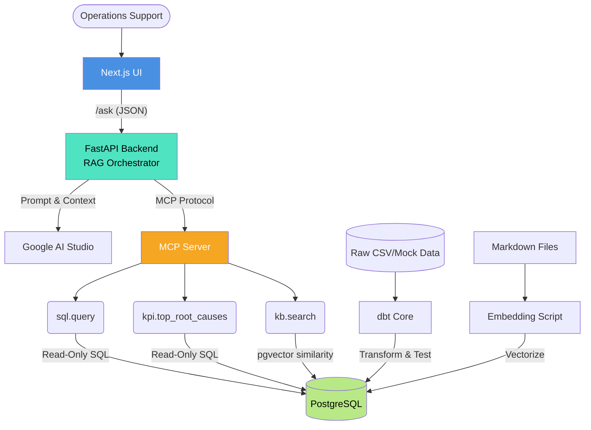
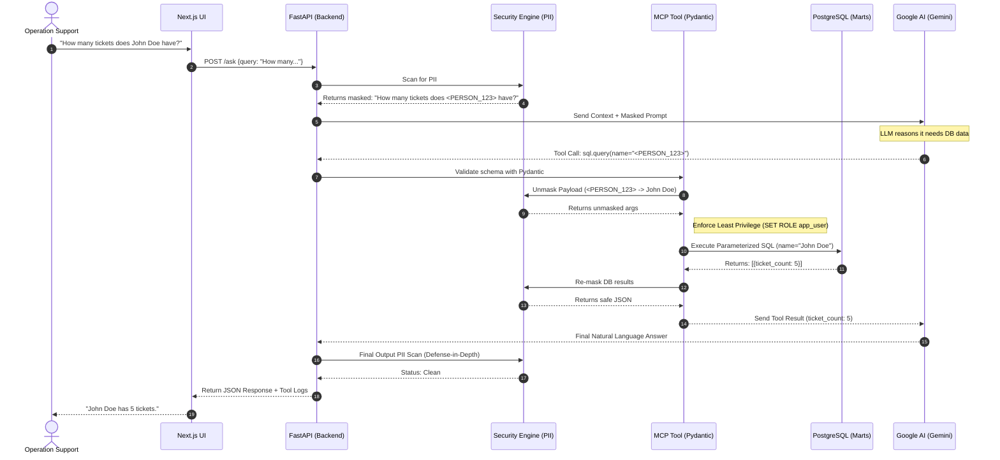
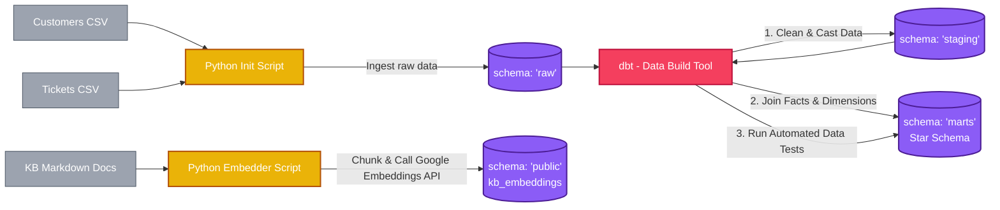
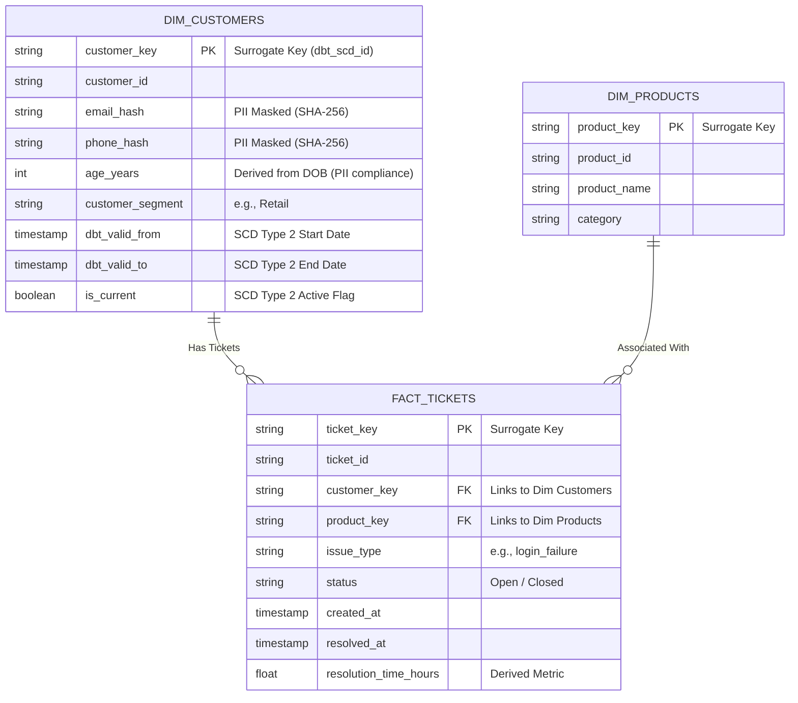

# Deep Insights Copilot: Architecture Diagrams

*Note for Presentation: These diagrams are written in **Mermaid.js** format. You can copy the code blocks below and paste them into [Mermaid Live Editor](https://mermaid.live/) or native GitHub/Notion markdown to render them as professional, high-quality images for your slide deck.*

---

## 1. High-Level System Architecture
**Purpose:** Show the CTO the complete flow from the user interface down to the AI orchestration and data layers, detailing how the MCP Server connects the LLM to PostgreSQL.



---

## 2. Secure Tool Execution Flow (Sequence Diagram)
**Purpose:** Show the precise step-by-step logic of how you protect sensitive data (PII) during the RAG / Tool invocation process. This proves your system is "Deployment-grade" for a bank.



---

## 3. Data Engineering & Transformation Pipeline
**Purpose:** Visually explain the "What to build (minimum)" section. Show how raw CSVs become clean Star Schemas and Vectors before the API ever boots up.



---

## 4. Star Schema (Marts Layer)
**Purpose:** Show the specific data modeling structure you built using dbt to optimize for LLM/MCP SQL generation. This highlights your understanding of Dimensional Modeling and Data Security (PII Masking).



---

## 5. Defense-in-Depth Security Flow (AI Guardrails)
**Purpose:** Illustrate the multiple layers of security implemented to protect against Prompt Injection, PII leakage, and SQL Injection. Use this when explaining the "Security Guardrails" section.

```mermaid
graph TD
    %% Styles
    classDef user fill:#9ca3af,color:white;
    classDef guardrail fill:#ef4444,stroke:#991b1b,color:white,stroke-width:2px;
    classDef pii fill:#f59e0b,stroke:#b45309,color:white,stroke-width:2px;
    classDef llm fill:#3b82f6,color:white;
    classDef db fill:#10b981,color:white;

    User([User Request]):::user

    %% Layer 1: Input Guardrails
    InputScan{"1. Input Guardrails\n(Prompt Injection Scan)"}:::guardrail
    Block1[Block Request & Log Audit]:::guardrail

    User --> InputScan
    InputScan -- "Malicious (e.g., 'Ignore previous instructions')" --> Block1

    %% Layer 2: PII Masking
    PIIMask["2. PII Tokenization\n(Microsoft Presidio)"]:::pii

    InputScan -- "Safe Request" --> PIIMask

    %% To LLM
    LLM[Google AI Studio\n(Receives Masked Prompt)]:::llm
    PIIMask -- "John -> <PERSON_123>" --> LLM

    %% Layer 3: Execution Guardrails
    ToolCall["Tool Request: sql.query"]
    LLM --> ToolCall

    Unmask["Unmask Arguments\n(<PERSON_123> -> John)"]:::pii
    ToolCall --> Unmask

    ExecGuard{"3. Execution Guardrails\n(SQL Injection Prevention)"}:::guardrail
    Unmask --> ExecGuard

    DB[(PostgreSQL)]:::db
    ExecGuard -- "SET ROLE app_user (Read-Only)\nParameterized Query (text())" --> DB

    %% Layer 4: Output Guardrails
    Remask["Re-mask DB Results"]:::pii
    DB --> Remask
    Remask --> LLM

    LLMFinal[Final LLM Response]
    LLM --> LLMFinal

    OutputScan{"4. Output Guardrails\n(PII Leakage Scan)"}:::guardrail
    LLMFinal --> OutputScan

    Block2[Fail Closed & Block Response]:::guardrail
    OutputScan -- "PII Detected in Output" --> Block2

    SafeResponse([Safe JSON Response]):::user
    OutputScan -- "Safe Output" --> SafeResponse
```