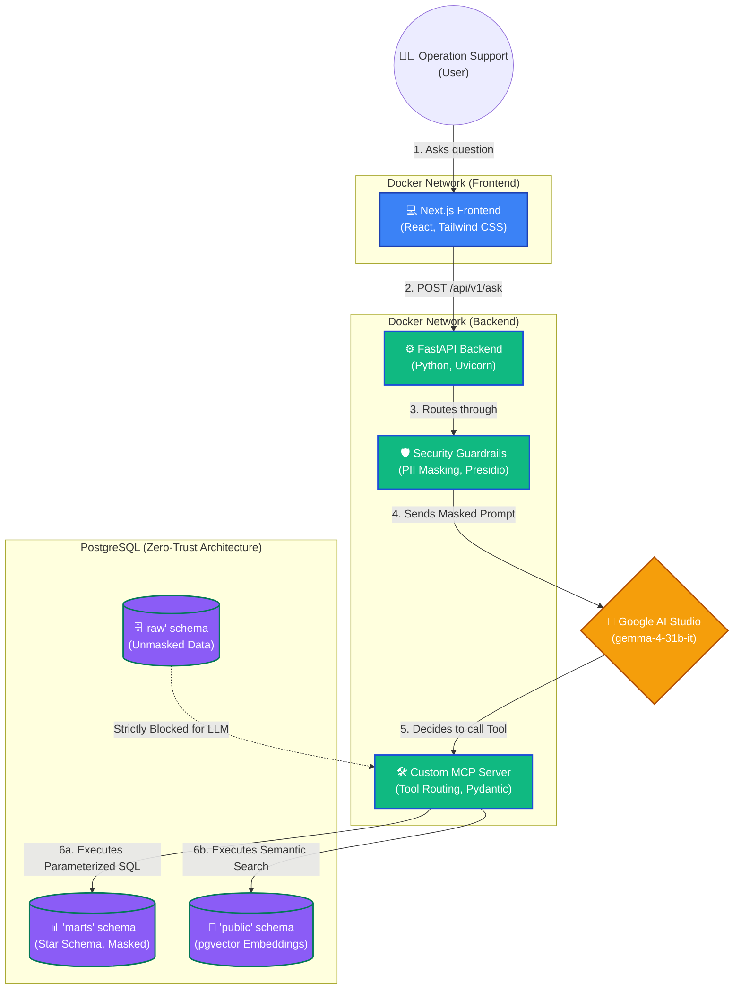

# Deep Insights Copilot: Architecture Diagrams

*Note for Presentation: These diagrams are written in **Mermaid.js** format. You can copy the code blocks below and paste them into [Mermaid Live Editor](https://mermaid.live/) or native GitHub/Notion markdown to render them as professional, high-quality images for your slide deck.*

---

## 1. High-Level System Architecture (C4 Container Diagram)
**Purpose:** Show the CTO the "Big Picture" of how the frontend, backend, database, and LLM provider interact, highlighting the security boundaries.



---

## 2. Secure Tool Execution Flow (Sequence Diagram)
**Purpose:** Show the precise step-by-step logic of how you protect sensitive data (PII) during the RAG / Tool invocation process. This proves your system is "Deployment-grade" for a bank.

```mermaid
sequenceDiagram
    autonumber
    actor User as Operation Support
    participant FE as Next.js UI
    participant BE as FastAPI (Backend)
    participant Sec as Security Engine (PII)
    participant MCP as MCP Tool (Pydantic)
    participant DB as PostgreSQL (Marts)
    participant LLM as Google AI (Gemini)

    User->>FE: "How many tickets does John Doe have?"
    FE->>BE: POST /ask {query: "How many..."}
    BE->>Sec: Scan for PII
    Sec-->>BE: Returns masked: "How many tickets does <PERSON_123> have?"
    BE->>LLM: Send Context + Masked Prompt

    Note over LLM: LLM reasons it needs DB data
    LLM-->>BE: Tool Call: sql.query(name="<PERSON_123>")

    BE->>MCP: Validate schema with Pydantic
    MCP->>Sec: Unmask Payload (<PERSON_123> -> John Doe)
    Sec-->>MCP: Returns unmasked args

    Note over MCP,DB: SET ROLE app_user; (Least Privilege)
    MCP->>DB: Execute Parameterized SQL (name="John Doe")
    DB-->>MCP: Returns: [{ticket_count: 5}]

    MCP->>Sec: Re-mask DB results
    Sec-->>MCP: Returns safe JSON
    MCP-->>LLM: Send Tool Result (ticket_count: 5)

    LLM-->>BE: Final Natural Language Answer
    BE->>Sec: Final Output PII Scan (Defense-in-Depth)
    Sec-->>BE: Status: Clean
    BE-->>FE: Return JSON Response + Tool Logs
    FE-->>User: "John Doe has 5 tickets."
```

---

## 3. Data Engineering & Transformation Pipeline
**Purpose:** Visually explain the "What to build (minimum)" section. Show how raw CSVs become clean Star Schemas and Vectors before the API ever boots up.

```mermaid
graph LR
    %% Styles
    classDef source fill:#9ca3af,stroke:#4b5563,color:white;
    classDef dbt fill:#f43f5e,stroke:#be123c,color:white,stroke-width:2px;
    classDef python fill:#eab308,stroke:#b45309,color:white,stroke-width:2px;
    classDef pg fill:#8b5cf6,stroke:#4c1d95,color:white,stroke-width:2px;

    %% Data Sources
    CSV1[📄 Customers CSV]:::source
    CSV2[📄 Tickets CSV]:::source
    DOCS[📝 KB Markdown Docs]:::source

    %% Processors
    INIT[⚙️ Python Init Script]:::python
    DBT[🔨 dbt (Data Build Tool)]:::dbt
    EMBED[🧠 Python Embedder Script]:::python

    %% PostgreSQL Targets
    RAW[(🗄️ schema: 'raw')]:::pg
    STG[(🗄️ schema: 'staging')]:::pg
    MART[(📊 schema: 'marts'\nStar Schema)]:::pg
    VEC[(🧠 schema: 'public'\nkb_embeddings)]:::pg

    %% Flow
    CSV1 --> INIT
    CSV2 --> INIT
    INIT -- "Ingest raw data" --> RAW

    RAW --> DBT
    DBT -- "1. Clean & Cast Data" --> STG
    STG --> DBT
    DBT -- "2. Join Facts & Dimensions" --> MART
    DBT -- "3. Run Automated Data Tests" --> MART

    DOCS --> EMBED
    EMBED -- "Chunk & Call Google Embeddings API" --> VEC
```