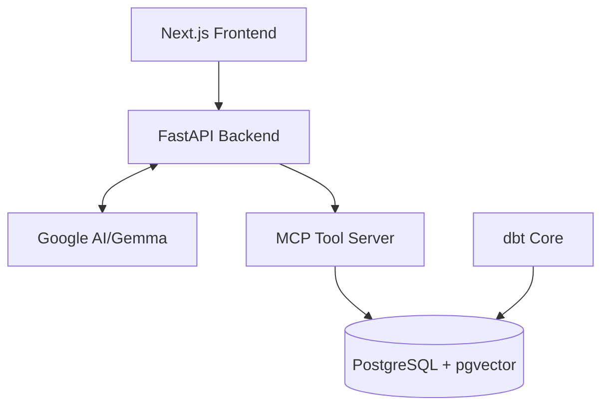
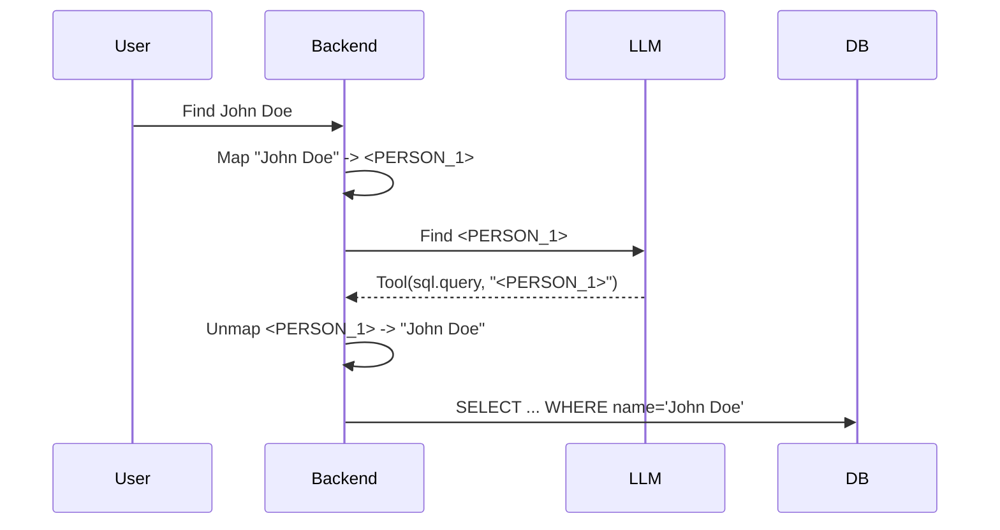

# dBank: Enterprise Deep Insights Copilot
**Secure, Agentic Data Exploration for Corporate Banking**

---
Presenter: Jinnawat Jidsanoa
Role: Mission Engineer Candidate

---

## The Friction of Enterprise LLM Deployment

*   **The Promise:** LLMs offer unparalleled orchestration and natural language data exploration.
*   **The Reality:** Highly regulated environments (Banking) have non-negotiable constraints on Data Privacy (PII) and Database Security.
*   **The Tension:**
    * If we redact PII, the LLM can't search accurately.
    * If we allow dynamic SQL, we risk systemic breaches via injection.

---

## The dBank Solution Architecture
**Containerized, Secure-by-Design**

*   **Frontend:** Next.js Chat UI
*   **Backend:** FastAPI Orchestrator
*   **Intelligence:** Gemma via MCP
*   **Data Store:** PostgreSQL + pgvector + dbt

---

## Innovation 1: Reversible PII Masking
**Solving the Privacy Paradigm via Tokenization**

*   **Result:** The external LLM never processes raw PII, while the system retains exact-match query capabilities.

---

## Innovation 2: Defense in Depth SQL Execution
**Agentic Capabilities Without Compromise**

### 1. Infrastructure Layer
*   **Least Privilege:** `app_user` role (Read-Only / `SELECT`).
*   **Schema Segregation:** Access limited to `marts` schema—never raw data.

### 2. Application Layer
*   **Parameterization:** SQLAlchemy `text()` neutralizes SQL injection.
*   **Input Guardrails:** Pydantic models validate all MCP tool requests.

---

## Live System Demonstration
**dBank in Action**

1.  **Scenario 1 (Unstructured RAG):** Querying internal policies via `pgvector` similarity search.
2.  **Scenario 2 (Structured SQL):** Dynamically querying aggregated ticket volumes.
3.  **Scenario 3 (Complex Orchestration):** Combining SQL data retrieval with PII masking and Knowledge Base synthesis.

---

## Architectural Decisions & The Roadmap
**Technical Trade-offs**

*   **PostgreSQL/pgvector vs. Dedicated Vector DB:** Chosen for ACID compliance and reduced operational overhead. Pinecone considered for massive scale (>100M vectors).
*   **dbt vs. Raw SQL Views:** Enforces software engineering CI practices on the data pipeline, resulting in cleaner LLM context.
*   **Cloud LLM vs. Local Model:** Currently utilizing Gemma; production banking roadmap entails a locally-hosted Llama 3 to guarantee absolute data residency.

---

# Questions & Discussion

Thank you for your time!
